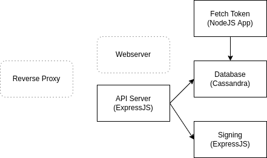

# Backend Web 3 API Stack

## Introduction
-----------------------
This project does the following:
1. Store price oracle data from Binance to a Cassandra Database for (ETH, MATIC, BNB).
2. ExpressJS API server that returns the price oracle data when queried by the Token name.
3. ExpressJS API server that forwards/proxies a request for singing and verifying EIP-712 unTypedData to a secure backend server running ethersjs

## Setup
-------------------------
1) Ensure git, docker & docker-compose is installed on your system
2) Git clone the repo
  ``` 
  git clone git@github.com:ndcic/backendweb3apistack.git 
  ```
3) Navigate into the folder
  ```
  cd backendweb3apistack
  ```
4) Fill in your Binance API Key and API Secret in the FetchToken/index.js file
  ```
  //In FetchToken/index.js
  ////// Binance API Init
  const apiKey = ''
  const apiSecret = ''
  const client = new Spot(apiKey, apiSecret)
  ```
6) Run docker-compose file to bring up the stack
  ```
  docker-compose up -d
  ```

## Architecture
----------------------------


## Stack Design Choices
------------------------------------
1. This is an attempt at a microservice stack with modular functionality
2. The API server which might be live and accessible to the public is kept on a separate docker network to the other Applications. This reduces the exposed attack surface.
3. Cassandra database was selected due to its microservice friendly horizontal scalability. The PRIMARY PARTITION KEY is set to the Token Pair, hence if we increase the Database nodes to 3, each Token can serve read/write requests concurrently of each other
4. Binance was chosed as the source of the Token Pair ticker data as they allow subsecond refresh rates (the FetchToken application is currently set to a 10s refresh cadence)
5. All Web3(Ethers/JsonRPC/Wallet) functionality separated in a separate API ExpressJS server and communicates with the main API server through REST API

## REST API
---------------------------------------------
1) Request token pair price from API server, can select date range within JSON Body
```
GET    <MainAPIServer>:3000/api/v1/price/<TokenID>
```


URL itself indicates TokenPair (ETHUSDT/BNBUSDT/MATICUSDT)

No Additional Parameters 

JSON Body
```
{
    "date_to": "2022-11-18",
    "date_from": "2022-11-1"
}
```

-----------------------------

2) Request API Server to sign Token price at a specified date. Returns EIP-712 signature
```
GET    <MainAPIServer>:3000/api/v1/sign
```
No URL parameters

JSON Body
```
{
    "token": "ETHUSDT",
    "date": "2022-11-18"
}
```
---------------------------
3) Request verification on previously signed data. Returns True/False
```
GET    <MainAPIServer>:3000/api/v1/verify
```

---------------------------------------------------

*Postman collection for testing in /Postman folder


